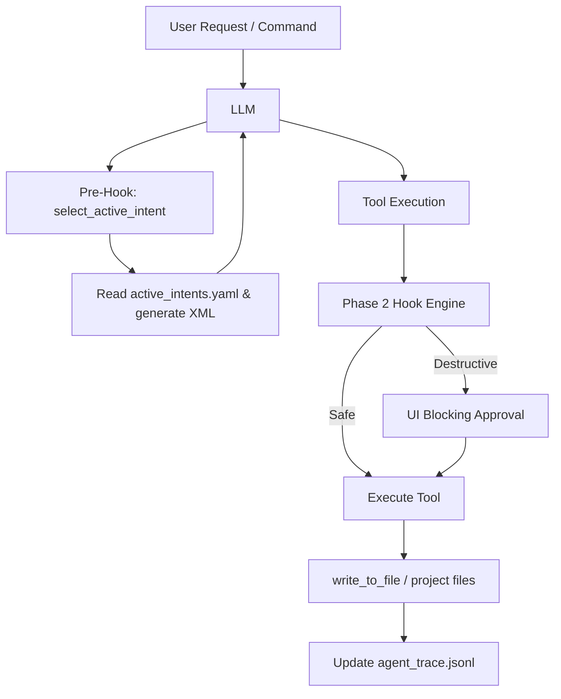

# Architecture Notes - Roo Code

## Phase 0: The Archaeological Dig

**Goal:** Map the “nervous system” of Roo Code and identify the points where the LLM interacts with the IDE and tools.

---

### 1. Extension Host Setup

- Roo Code runs as a VS Code extension.
- CLI commands (via Roo Cline) and internal tools interact with the Extension Host.
- Core tool execution happens in `packages/core/src/hooks/hook_engine.ts` and `packages/core/src/tools/`.

---

### 2. Tool Loop Mapping

**Key Functions:**

| Function               | Location                                        | Purpose                                 |
| ---------------------- | ----------------------------------------------- | --------------------------------------- |
| `execute_command`      | Extension Host / main CLI handler               | Receives tool requests from the LLM     |
| `write_to_file`        | packages/core/src/tools/write_file.ts           | Handles file writes in the codebase     |
| `select_active_intent` | packages/core/src/tools/select_active_intent.ts | Returns intent context for the given ID |
| `get_intent_trace`     | packages/core/src/tools/get_intent_trace.ts     | Returns trace info of an intent         |

---

### 3. System Prompt Construction

- Constructed in: `packages/core/src/llm/prompt_builder.ts`
- Injects LLM instructions.
- Phase 1 modifies prompt to enforce:
    > “You are an Intent-Driven Architect. You CANNOT write code immediately. Your first action MUST be to analyze the user request and call `select_active_intent` to load the necessary context.”

---

### 4. Architecture Diagram

Flow: User sends a command → LLM consults Pre-Hook → select_active_intent loads context → Hook Engine evaluates safety and scope → Tool executes → Files updated → Trace appended.

### 5. Observations

- The IDE loop is asynchronous, but the LLM operates synchronously.
- Hooks (Phase 2) are required to enforce security boundaries, scope enforcement, and user approval.
- Each intent can only modify files within its defined scope (owned_scope), ensuring trust and separation.
- Tool requests outside the allowed scope are blocked with a standardized JSON error.

### 6. Deliverables for Phase 0

- ARCHITECTURE_NOTES.md (this file)
- Mapping of tool loop and hooks.
- Identification of prompt builder location and LLM integration points.
