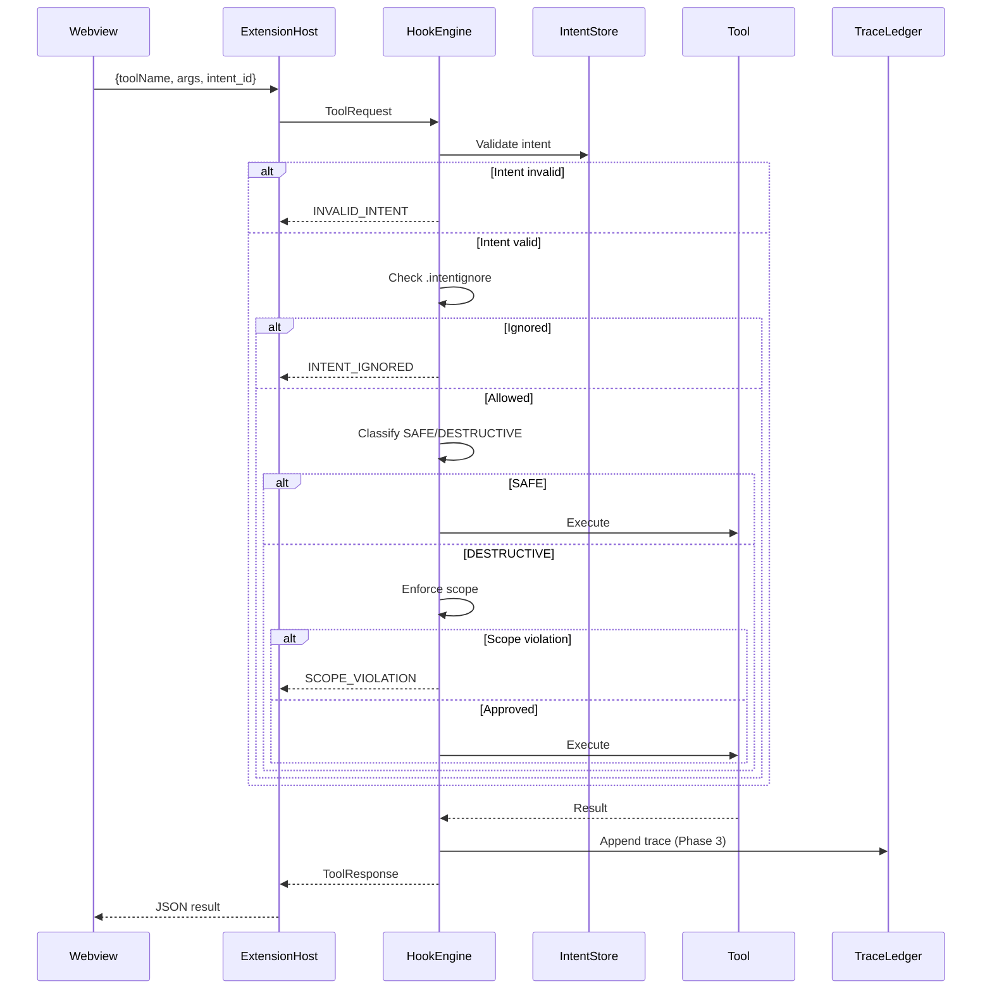

# Architecture Notes – Roo Code Extension

## Phases 0–2 Structural Analysis

# Phase 0 — Host Extension Architectural Analysis

**“The Archaeological Dig”**

## Objective

Map the full lifecycle of a single agent turn and identify:

- Where the System Prompt is constructed
- How tool calls are parsed and executed
- How data crosses boundaries (Webview ↔ Extension Host)
- The exact chokepoint where the Hook Engine is injected

This phase ensures structural mastery of the host extension rather than surface-level documentation understanding.

---

## 1. Full Lifecycle of a Single Agent Turn

A single agent turn proceeds as follows:

1. User submits a request via VS Code UI (Webview).
2. Webview sends a JSON message to the Extension Host.
3. Extension Host forwards the request to the LLM with the constructed System Prompt.
4. LLM responds with a structured tool call.
5. Extension Host parses the tool call into an internal `ToolRequest`.
6. `runTool()` in `hook_engine.ts` intercepts the request.
7. Hook Engine validates, enforces boundaries, and either:
    - Executes the tool
    - Rejects with structured error
8. Tool executes (e.g., `write_file`).
9. Result is returned to Webview.
10. _(Phase 3 preview)_ Trace entry appended to `agent_trace.jsonl`.

This establishes the complete nervous system of the extension.

---

## 2. Structural Trace of Execution

| Stage                      | Module                                    | Responsibility                               | Data Shape                                         |
| -------------------------- | ----------------------------------------- | -------------------------------------------- | -------------------------------------------------- |
| System Prompt Construction | `packages/core/src/llm/prompt_builder.ts` | Builds system instructions injected into LLM | Prompt string                                      |
| Command Reception          | `extension.ts`                            | Receives tool calls from Webview             | `{ toolName, args, intent_id }`                    |
| Tool Parsing               | Extension Host logic                      | Converts JSON → `ToolRequest` object         | `ToolRequest`                                      |
| Injection Chokepoint       | `packages/core/src/hooks/hook_engine.ts`  | Central interception point (`runTool`)       | `ToolRequest → ToolResponse`                       |
| Tool Execution             | `packages/core/src/tools/*.ts`            | Performs operation (`write_file`, etc.)      | Tool-specific payload                              |
| Trace Logging (Phase 3)    | `agent_trace.jsonl`                       | Immutable execution ledger                   | `{ intent_id, content_hash, toolName, timestamp }` |

---

## 3. Data Boundaries (UI ↔ Logic Layer)

### Boundary 1: Webview → Extension Host

JSON message sent via VS Code messaging API.

```json
{
  "toolName": "write_file",
  "args": [...],
  "intent_id": "REQ-001"
}
```

**Boundary 2: Extension Host → Hook Engine**

- JSON transformed into strongly-typed ToolRequest
- Passed to runTool()

**Boundary 3: Hook Engine → Tool**

- Only after validation
- Destructive tools gated by scope + ignore checks

**Boundary 4: Extension Host → Webview**

- Returns structured ToolResponse.

```ts
type ToolResponse = {
	success: boolean
	result?: unknown
	error?: ToolError
}
```

# 4. Injection Chokepoint (Critical Architectural Decision)

The Hook Engine is injected at:
`packages/core/src/hooks/hook_engine.ts`

Specifically inside:
`runTool(request: ToolRequest)`
This function wraps all tool executions.

**Why this location?**

- It is downstream from LLM parsing.
- It is upstream from tool execution.
- It centralizes enforcement logic.
- It prevents bypassing via direct tool invocation.

This is the structural control layer of the extension.

# 5. System Prompt Construction (Context Control Layer)

Located at:
`packages/core/src/llm/prompt_builder.ts`

Phase 1 modifies the prompt to enforce:

```
The agent must first call select_active_intent before executing any destructive action.
```

**Constraint**
The system prompt is stateless and rebuilt on every turn. Therefore, context must be re-injected dynamically via the handshake mechanism. This constraint motivates the Two-Stage Reasoning Loop.

# Phase 1 — The Reasoning Loop (Two-Stage Handshake)

**Objective**
Solve the Context-Injection Paradox:

- The agent must not act without explicit context selection.

**Two-Stage Handshake Architecture**
**Stage 1 — Intent Selection (Trigger Mechanism)**
Tool:

```ts
select_active_intent(intent_id: string)
```

Behavior:

- Loads intent metadata from active_intents.yaml
- Constructs <intent_context> XML
- Injects scope + constraints into agent reasoning

This forces a pause before action.

**Stage 2 — Gatekeeper Enforcement**
After selection, the Hook Engine enforces:

- Intent existence
- `.intentignore` check
- Scope validation
- Optional user approval

Structured recovery on failure.

**Failure Modes & Recovery**
Failure | Returned Error
Intent missing | INVALID_INTENT
Intent ignored | INTENT_IGNORED
Scope violation | SCOPE_VIOLATION
User rejection | USER_REJECTED
Errors are returned as structured JSON so the LLM can self-correct.

**Theoretical Grounding: Trust & Cognitive Debt**
Without enforced intent selection:

- The agent accumulates Cognitive Debt (implicit assumptions).
- The system accumulates Trust Debt (unverified mutations).

By forcing explicit selection and scope ownership:

- Intent becomes verifiable.
- File mutations become accountable.
- Governance is encoded into architecture.

**Phase 2 — Hook Middleware & Security Boundary**
Core Responsibilities

- Classify commands as SAFE or DESTRUCTIVE.
- Enforce owned file scope.
- Block ignored intents.
- Provide structured recovery.
- Optionally request user approval.

**Command Classification**

- SAFE → read-only operations
- DESTRUCTIVE → write_file, delete_file, execute

Only DESTRUCTIVE commands trigger scope enforcement.

**Data Model**

```ts
type ToolRequest = {
	toolName: string
	args: unknown[]
	intent_id: string
	targetFile?: string
}

type ToolError = {
	type: "INVALID_INTENT" | "SCOPE_VIOLATION" | "USER_REJECTED" | "INTENT_IGNORED"
	intent_id?: string
	target?: string
	message: string
}

type ToolResponse = {
	success: boolean
	result?: unknown
	error?: ToolError
}
```

**Visual System Blueprint**
Complete Sequence Diagram (Happy + Error Paths)



# Phase 3 (Preview) — AI-Native Git Layer

- Extend `write_file` to require `intent_id` and `mutation_class`
- Compute SHA-256 content hash
- Append immutable entry to agent_trace.jsonl

Distinguish:

- AST_REFACTOR
- INTENT_EVOLUTION

This transforms the hook layer into an auditable semantic versioning system.

# Conclusion

This architecture: - Maps the full lifecycle of a single agent turn - Identifies exact injection chokepoint (`runTool()`) - Defines data boundaries clearly - Implements a Two-Stage Handshake - Encodes governance into middleware - Handles failure and recovery - Provides implementable sequence diagrams - Aligns technical design with trust and cognitive debt theory
